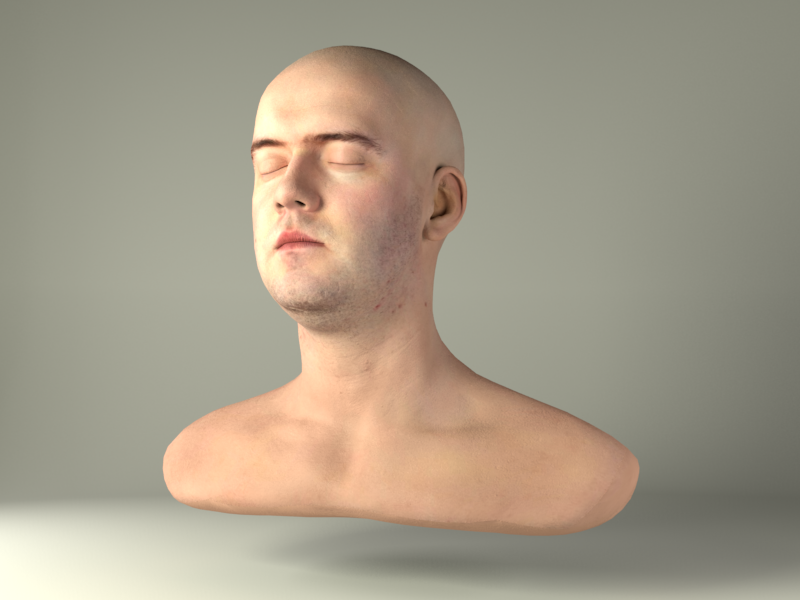
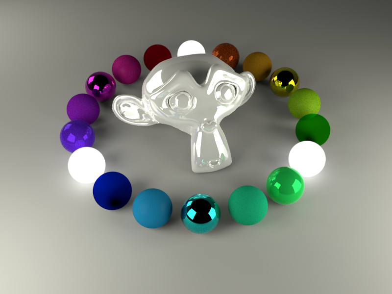

#threeflow.js : sunflow for three.js

###version <%= @version %> - beta

###Overview

Threeflow.js lets you render three.js scenes with the sunflow renderer.  If you don't know what sunflow is - it's a 3D ray tracer that renders photo-realistic images - visit here for more information.

Threeflow.js is in beta, but gives support of rendering standard three.js Meshes using Geometry or BufferGeometry/Geometry2.  Materials in three.js will be mapped to default materials in sunflow or you can ( or should for now ) use the threeflow materials directly.

###Installation

Make sure you have java and npm installed; then run the npm install command with the -g option:
```shell
npm install -g threeflow
```

Threeflow needs to render images and scene files into a folder on your hard drive. It also needs a static folder to deliver via its local http server. Threeflow can set this up for you with the init command.

Create a new folder, and from inside that folder run:
```shell
threeflow init
```
This should setup a project folder, copying examples and creating render folders. See below for more info on project structure.

To start the server and start rendering run:
```shell
threeflow start
```
Then in the browser connect to: http://localhost:3710

------------------------------------------------------------------------------
#### Screenshot.


------------------------------------------------------------------------------
#### Renders.

Camaro


Lee Perry Smith


Suzanne



------------------------------------------------------------------------------

### Major to-do.
+ ao materials & ao overrides

### Usage
To come..

**coffescript example:**
```coffee
# create an instance of the renderer
# along with some render output paths

renderer = new THREEFLOW.SunflowRenderer
pngPath: "renders/myRender.png"

# connect to the socket server.
renderer.connect()

# to render a three.js scene:
renderer.render scene,camera,width,height

```

### Project structure
[Example source can be found here](<%= @path %>templates/default)

### Materials
[Material documentation found here](<%= @path %>src/client/materials)

### Lights
[Lights documentation found here](<%= @path %>src/client/lights)

### References

The majority of the information on Sunflow can be found in the Sunflow Wiki.
To better understand the full .sc file parser, the source code for the parser can be
found in the ScParser.java file in the source.

**Sunflow Site**

+ http://sunflow.sourceforge.net/

**Sunflow Wiki**

+ http://www.geneome.com/sunflow-wiki/
+ http://geneome.com/sunflow/sfwiki.pdf

**Sunflow Source**

+ https://github.com/fpsunflower/sunflow
+ https://github.com/fpsunflower/sunflow/blob/master/src/org/sunflow/core/parser/SCParser.java

**Sunflow Misc**

+ http://home.comcast.net/~gamma-ray/sf/sunflow-faq.htm


------------------------------------------------------------------------------


